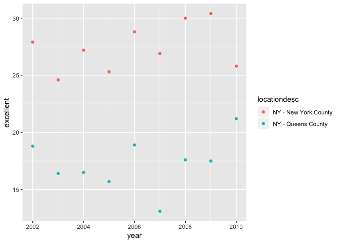

p8105\_hw2\_xc2474
================

``` r
library(tidyverse)
```

    ## ── Attaching packages ────────────────────────────────────────────────────────────── tidyverse 1.2.1 ──

    ## ✔ ggplot2 3.0.0     ✔ purrr   0.2.5
    ## ✔ tibble  1.4.2     ✔ dplyr   0.7.6
    ## ✔ tidyr   0.8.1     ✔ stringr 1.3.1
    ## ✔ readr   1.1.1     ✔ forcats 0.3.0

    ## ── Conflicts ───────────────────────────────────────────────────────────────── tidyverse_conflicts() ──
    ## ✖ dplyr::filter() masks stats::filter()
    ## ✖ dplyr::lag()    masks stats::lag()

``` r
library(knitr)
```

Problem 1
=========

Read and clean data
-------------------

import csv file

``` r
nyc_sub = read.csv("./data/NYC_Transit_Subway_Entrance_And_Exit_Data.csv")
```

clean the data

``` r
nyc_sub_tidy = nyc_sub %>%
  janitor::clean_names() %>%
  select(line:entry, vending, ada) %>%
  mutate(entry = recode(entry, YES = TRUE, NO = FALSE))
```

This dataset contains 19 variables, which is line, station\_name, station\_latitude, station\_longitude, route1, route2, route3, route4, route5, route6, route7, route8, route9, route10, route11, entrance\_type, entry, vending, ada

My data cleaning steps are as follows: 1. import the data. 2. apply janitor::clean\_names() function to change the variable names into a more readable way (all lowercase and only contain "\_"). 3. retain the variables we want using select funtion, which will remove the variables we don't need. 4. use recode() function to change all "YES" and "NO" in entry variable into correspongding "TRUE" and "FALSE" (make entry variable to a logical variable), and use mutate() function to retain the change in nyc\_sub\_tidy dataset.

The dimension of the resulting dataset is 1868 rows x 19

I think although these data are tidier than before, but they are not tidy enough.

Questions
---------

Q1: How many distinct stations are there?

``` r
distinct(nyc_sub_tidy, station_name, line) %>%
  nrow()
```

    ## [1] 465

A: There are 465 distinct stations.

Q2: How many stations are ADA compliant?

If we define "ADA compliant" in a broad way, which means as long as ada=TRUE, we consider this station as ADA compliant:

``` r
nyc_sub_tidy %>%
  filter(ada == TRUE) %>%
  distinct(station_name, line) %>%
  nrow()
```

    ## [1] 84

In this case, there are 84 stations are ADA compliant.

However, look the ADA.Notes in the original dataset, for some station, the ADA services are still in construction, or not the exact "ADA". If we define "ADA comliant" in a restricted way, we should exclude those "so-called" ADA.

``` r
nyc_sub %>%
  janitor::clean_names() %>%
  filter(ada == TRUE & ada_notes == '') %>%
  distinct(station_name, line) %>%
  nrow()
```

    ## [1] 76

In this case, there are 76 stations are ADA compliant.

Q3: What proportion of station entrances / exits without vending allow entrance?

``` r
nrow(filter(nyc_sub_tidy, vending == "NO", entry == "TRUE")) / 
  nrow(filter(nyc_sub_tidy, vending == "NO"))
```

    ## [1] 0.3770492

A: The proportion of station entrances / exits without vending allow entrance is 0.3770492.

Reformat data so that route number and route name are distinct variables

``` r
nyc_sub_tidy = nyc_sub_tidy %>%
  gather(key = "route_number", value = "route_name", route1:route11) %>%
  separate(route_number, into = c('remove', 'route_number'), sep = 5) %>%
  select(-remove)
```

    ## Warning: attributes are not identical across measure variables;
    ## they will be dropped

Q: How many distinct stations serve the A train? Of the stations that serve the A train, how many are ADA compliant?

``` r
nyc_sub_tidy %>%
  filter(route_name == "A") %>%
  distinct(station_name, line) %>%
  nrow()
```

    ## [1] 60

``` r
nyc_sub_tidy %>%
  filter(route_name == "A", ada == TRUE) %>%
  distinct(station_name, line) %>%
  nrow()
```

    ## [1] 17

A: There are 60 distinct station serve the A train, and there are 17 of them are ADA compliant.

Problem 2
=========

Read and clean data
-------------------

import Mr. Trash Wheel xlsx file, and clean the data:

1.  specify the sheet in the Excel file and to omit columns containing notes (using the range argument and cell\_cols() function)
2.  use reasonable variable names
3.  omit rows that do not include dumpster-specific data 4)rounds the number of sports balls to the nearest integer and converts the result to an integer variable (using as.integer)

``` r
tw_data = readxl::read_excel("./data/HealthyHarborWaterWheelTotals2017-9-26.xlsx", range = 'A2:N258' ) %>%
  janitor::clean_names() %>%
  filter(dumpster != "NA") %>%
  mutate(sports_balls = as.integer(sports_balls))
```

Read and clean precipitation data for 2016 and 2017. For each, omit rows without precipitation data and add a variable year.

``` r
data_pre_2016 = readxl::read_excel("./data/HealthyHarborWaterWheelTotals2017-9-26.xlsx", sheet = '2016 Precipitation', range = "A2:B14") %>%
  janitor::clean_names() %>%
  filter(total != 'NA') %>%
  mutate(year = 2016)

data_pre_2017 = readxl::read_excel("./data/HealthyHarborWaterWheelTotals2017-9-26.xlsx", sheet = '2017 Precipitation', range = "A2:B14") %>%
  janitor::clean_names() %>%
  filter(total != 'NA') %>%
  mutate(year = 2017)
```

Next, combine datasets and convert month to a character variable (the variable month.name is built into R and should be useful).

``` r
data_pre = bind_rows(data_pre_2016, data_pre_2017) %>%
  mutate(month = month.name[month])
```

Comment
-------

In the Mr. Trash Wheel dataset, there are 14 variables and and 215 observations. According to the introduction of Mr. Trash Wheel, the key variables here are `dumpster`, `date`, `weight_tons` and `homes_powered`. The median number of sports balls in a dumpster in 2016 is 26. In the precipitation dataset, there are 3 variables and 20. From these 20 observations, 12 observations come from 2016, 8 observations come from 2017. The key variables here are `month`, `year` and `total`. The total precipitation in 2017 was 29.93.

Problem 3
=========

Read and clean data
-------------------

``` r
library(p8105.datasets)
```

Import BRFSS data

``` r
brfss_data = brfss_smart2010 %>%
  filter(Topic == 'Overall Health') %>%
  select(-c(Class, Topic, Question, Sample_Size, Confidence_limit_Low:GeoLocation)) %>%
  spread(key = Response, value = Data_value) %>%
  janitor::clean_names() %>%
  select(year, locationabbr, locationdesc, excellent, very_good, good, fair, poor) %>%
  mutate(high_prop = excellent + very_good)
```

Questions
---------

Q1:

1.  How many unique locations are included in the dataset?

``` r
brfss_data %>%
  distinct(locationdesc) %>%
  nrow()
```

    ## [1] 404

A: There are 404 unique locations are included in the dataset.

1.  Is every state represented?

``` r
brfss_data %>%
  distinct(locationabbr) %>%
  nrow()
```

    ## [1] 51

A: There are 51 unique states in this dataset, which equals to the number of states in the United States.

1.  What state is observed the most?

``` r
count(brfss_data, locationabbr, sort = TRUE)
```

    ## # A tibble: 51 x 2
    ##    locationabbr     n
    ##    <chr>        <int>
    ##  1 NJ             146
    ##  2 FL             122
    ##  3 NC             115
    ##  4 WA              97
    ##  5 MD              90
    ##  6 MA              79
    ##  7 TX              71
    ##  8 NY              65
    ##  9 SC              63
    ## 10 CO              59
    ## # ... with 41 more rows

A: NJ

Q2: In 2002, what is the median of the “Excellent” response value?

``` r
median(filter(brfss_data, year == 2002)$excellent, na.rm = TRUE)
```

    ## [1] 23.6

A: Through removing NA value from the dataset, we get the median of "Excellent" response value which is 23.6. If we do not remove NA value from the dataset, the median will be NA.

Q3: Make a histogram of “Excellent” response values in the year 2002.

A: The histogram is shown as below:

``` r
brfss_data %>%
  filter(year == 2002) %>%
  ggplot(aes(x = excellent)) + 
  geom_histogram()
```

    ## `stat_bin()` using `bins = 30`. Pick better value with `binwidth`.

    ## Warning: Removed 2 rows containing non-finite values (stat_bin).


Q4: Make a scatterplot showing the proportion of “Excellent” response values in New York County and Queens County (both in NY State) in each year from 2002 to 2010.

A: As the range of year in the original dataset is exactly from 2002 to 2010, there is no need to filter the dataset according to the given period of the year. The scatterplot is shown as below:

``` r
brfss_data %>%
  filter(locationdesc == 'NY - Queens County' | locationdesc == 'NY - New York County') %>%
  ggplot(aes(x = year, y = excellent)) +
  geom_point(aes(color = locationdesc))
```


